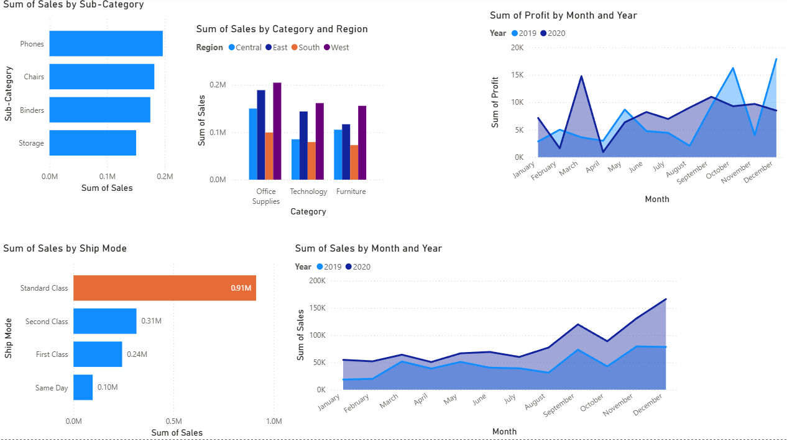
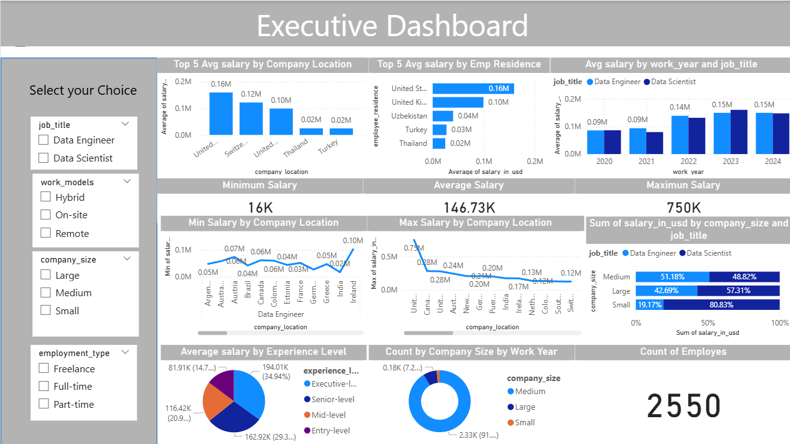

# Power BI Dashboard Projects

This repository contains two interactive Power BI dashboard projects:  

1. **Sales Analysis Dashboard** – focused on product, customer, and regional sales insights.  
2. **Executive Salary Dashboard (DASCA)** – focused on salary trends for Data Scientists and Data Engineers from 2020–2024.  

Both projects showcase data cleaning, modeling, and visualization skills using **Power Query, DAX, and Power BI**.

---

## 📊 Project 1: Sales Analysis Dashboard

### Overview
The Sales Analysis Dashboard was created to analyze retail sales data across products, customers, regions, and time. The goal was to help business stakeholders track sales performance, identify top customers, and evaluate profit trends.

### Dataset
The dataset includes:
- **Product-level attributes**: Category, Sub-Category, Product Name  
- **Sales attributes**: Sales, Quantity, Profit, Returns, Payment Mode  
- **Customer & region details**: Customer ID, Segment, Country, City, State, Region  
- **Order details**: Order ID, Order Date, Ship Date, Ship Mode  

### Key Insights
- **Top Products**: Phones and Chairs contributed the most revenue.  
- **Regional Performance**: The East and West regions generated stronger sales compared to Central and South.  
- **Profit Trends**: Profits peaked during holiday months, especially in Q4.  
- **Shipping Modes**: Standard Class shipping accounted for the majority of orders.  
- **Customer Segments**: Consumer segment represented the largest share of sales.  

### Dashboard Preview
  
*(replace with actual screenshot filename, e.g., `Screenshot_2025-09-13-110707.png`)*  

---

## 📊 Project 2: Executive Salary Dashboard (DASCA)

### Overview
This dashboard was developed as part of a case study for the **Data Science Council of America (DASCA)**. It visualizes salary trends for Data Scientists and Data Engineers from 2020 to 2024. The goal was to support DASCA’s Board of Advisors in making strategic decisions for certifications and programs.

### Dataset
- **Records**: 2,550 salary entries  
- **Columns**: job_title, experience_level, employment_type, work_models, work_year, employee_residence, salary_in_usd, company_location, company_size  
- **Coverage**: Multiple countries, company sizes (small, medium, large), and work models (remote, hybrid, on-site).  

### Key Insights
- **Top Locations**: U.S. and Switzerland offered the highest salaries; Turkey and Thailand offered the lowest.  
- **Salary Growth**: Salaries rose steadily from 2020 to 2023, with a slight decline in 2024.  
- **Work Models**: Remote roles paid the most; hybrid roles paid the least.  
- **Company Size**: Medium-sized companies offered the highest average salaries.  
- **Employment Type**: Full-time roles dominated; freelance roles showed growth potential.  

### Recommendations
- Expand certification programs in **high-paying regions** (U.S., Switzerland).  
- Prioritize **remote work certifications**.  
- Target **medium-sized companies** for specialized programs.  
- Explore future opportunities in **freelance certifications**.  

### Dashboard Preview
  


---

## 🛠️ Tools Used
- Power BI Desktop (visualizations, DAX, dashboards)  
- Power Query (data cleaning & transformations)  
- GitHub (version control & sharing)  

---

## 🚀 How to Use
1. Clone the repository:  
   ```bash
   git clone https://github.com/YOUR_USERNAME/your-repo-name.git
